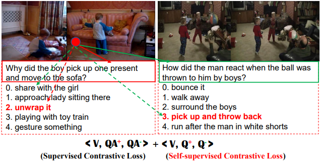
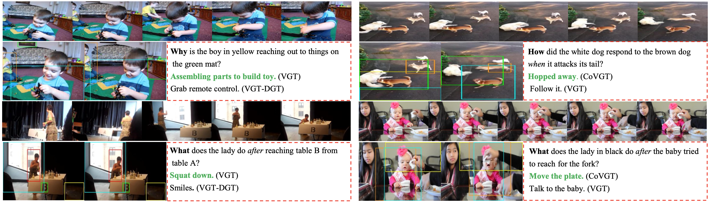

# Contrastive Video Question Answering via Video Graph Transformer (IEEE T-PAMI'23)
<details open>
<summary> <b>Abstract</b> </summary>
This repo holds the code for our paper <a href="https://arxiv.org/abs/2302.13668">CoVGT</a> accepted to IEEE T-PAMI'23. The work extends our preliminary publication at <a href="https://link.springer.com/chapter/10.1007/978-3-031-20059-5_3">ECCV'22</a>. We highlight the following differences compared to the conference version:

* A supervised and self-supervised contrastive objectives between the correct and incorrect answers, as well as the relevant and irrelevant questions, respectively. 
* Substitute BERT with a stronger language model (e.g., RoBERTa) for QA embedding.
* Extended results on Causal-VidQA and STAR-QA and more comprehensive ablation studies.
  
The code is based on <a href="https://github.com/sail-sg/VGT">VGT</a>.
</details>


<div align="center">
  
</div>

## Todo
1. [ ] Release feature of other datasets. Please email the first author and specify the reason as the data is strictly for research purpose.

## Environment
Assume you have installed Anaconda3, cuda version > 11.0 with gpu memory > 24G, please do the following to setup the envs:
```
>conda create -n videoqa python==3.10.9
>conda activate videoqa
>git clone https://github.com/doc-doc/CoVGT.git
>pip install -r requirements.txt
```
## Preparation
Please create a data folder outside this repo, so you have two folders in your workspace 'workspace/data/' and 'workspace/CoVGT/'. 

Below we use NExT-QA as an example to get you farmiliar with the code. 
Please download the related video feature and QA annotations according to the links provided in the ```Results and Resources``` section. Download and save QA annotations into ```workspace/CoVGT/datasets/nextqa/``` (already done), video features into ```workspace/data/nextqa/``` and checkpoint files into ```workspace/data/save_models/nextqa/```. Change default paths in global_parameters.py and args.py for your own datasets.

## Inference
```
./shell/next_test.sh 0
```
## Evaluation
```
python eval_next.py --folder CoVGT_FTCoWV --mode test
``` 

## Results and Resources
**<p align="center">Table 1. VideoQA Accuracy (%) on Test Set.</p>**
<table>
  <tr>
    <th>Cross-Modal Pretrain</th>
    <th><a href="https://github.com/doc-doc/NExT-QA", target="_blank">NExT-QA</a></th>
    <th><a href="https://github.com/bcmi/Causal-VidQA", target="_blank">Causal-VidQA</a></th>
    <th><a href="https://bobbywu.com/STAR/">STAR</a></th>
    <th><a href="https://github.com/YunseokJANG/tgif-qa", target="_blank">TGIF-QA</a> (Action)</th>
    <th>TGIF-QA (Trans)</th>
    <th>TGIF-QA (FrameQA)</th>
    <th>TGIF-QA-R* (Action)</th>
    <th>TGIF-QA-R* (Trans)</th>
    <th><a href="https://github.com/xudejing/video-question-answering">MSRVTT-QA</a></th>
  </tr>
  <tr>
    <td>-</td>
    <td>59.4</td>
    <td>59.1</td>
    <td>44.0</td>
    <td>94.7</td>
    <td>97.6</td>
    <td>61.6</td>
    <td>60.8</td>
    <td>73.8</td>
    <td>38.3</td>
  </tr>
  
  <tr>
    <td><a href="https://drive.google.com/file/d/18KUgq22hLRmRfCgfMf_TXRgjCt3NE8vO/view?usp=sharing">WebVid0.18M</a></td>
    <td><a href="https://drive.google.com/file/d/1Udhm0BdD_YgcrLZ7RwMXwkKGlW-vHo7H/view?usp=sharing">59.7<a></td>
    <td>60.8</td>
    <td>46.2</td>
    <td>91.3</td>
    <td>96.2</td>
    <td>61.7</td>
    <td>61.0</td>
    <td>73.2</td>
    <td>40.0</td>
  </tr>
  <tr>
   <td>-</td>
    <td><a href="https://drive.google.com/file/d/19TRupHHAP9m0eE9n3b2HMcliiJE9VGcN/view?usp=sharing">feats</a></td>
    <td>feats</td>
    <td>feats</td>
    <td>feats</td>
    <td>feats</td>
    <td>feats</td>
    <td>feats</td>
    <td>feats</td>
    <td><a href="https://drive.google.com/file/d/14efO-eeYFSKKPhhG3AUqJLOONm80xDo8/view?usp=sharing">feats</a></td>
  </tr>
  <tr>
    <td>-</td>
    <td><a href="https://drive.google.com/file/d/1jTcRCrVHS66ckOUfWRb-rXdzJ52XAWQH/view?usp=sharing">videos</a></td>
    <td>videos</td>
    <td>videos</td>
    <td>videos</td>
    <td>videos</td>
    <td>videos</td>
    <td>videos</td>
    <td>videos</td>
    <td>videos</td>
  </tr>
  <tr>
    <td>-</td>
    <td><a href="https://github.com/doc-doc/CoVGT/tree/main/datasets/nextqa">Q&A</a></td>
    <td>Q&A</td>
    <td>Q&A</td>
    <td><a href="https://drive.google.com/file/d/1CE04mDGiQ2EcG5zbQAgERi-EukiIPKSw/view?usp=sharing">Q&A</a></td>
    <td>Q&A</td>
    <td>Q&A</td>
    <td><a href="https://drive.google.com/file/d/1arKsPSkx9DwlX1SpP_qoh30PgfgitKQv/view?usp=sharing">Q&A</a></td>
    <td>Q&A</td>
    <td><a href="https://drive.google.com/file/d/1vstHqtgZQBkPzzRTZo-Nb15rAQ4b7gOl/view?usp=sharing">Q&A</a></td>
  </tr>
</table>
(We have merged some files of the same dataset to avoid too many links.)

## Train
We have provided all the scripts in the folder 'shells', you can start your training by specifying the GPU IDs behind the script. (If you have multiple GPUs, you can separate them with comma: ./shell/nextqa_train.sh 0,1)
```
./shell/nextqa_train.sh 0
```
It will train the model and save to the folder 'save_models/nextqa/CoVGT/'. You will get results around 60.1% and 59.4% on the val and test set respectively.

### Result Visualization (NExT-QA)
<div align="center">
  
</div>

## Citations 
```
@article{xiao2023contrastive,
  title={Contrastive Video Question Answering via Video Graph Transformer},
  author={Xiao, Junbin and Zhou, Pan and Yao, Angela and Li, Yicong and Hong, Richang and Yan, Shuicheng and Chua, Tat-Seng},
  journal={IEEE Transactions on Pattern Analysis and Machine Intelligence},
  year={2023}
}
```
```
@inproceedings{xiao2022video,
  title={Video Graph Transformer for Video Question Answering},
  author={Xiao, Junbin and Zhou, Pan and Chua, Tat-Seng and Yan, Shuicheng},
  booktitle={European Conference on Computer Vision},
  pages={39--58},
  year={2022},
  organization={Springer}
}
```
## Notes
If you use any resources from this repo, please kindly cite our paper and acknowledge the source.
## License
This repository is released under the Apache 2.0 license as found in the [LICENSE](LICENSE) file.
